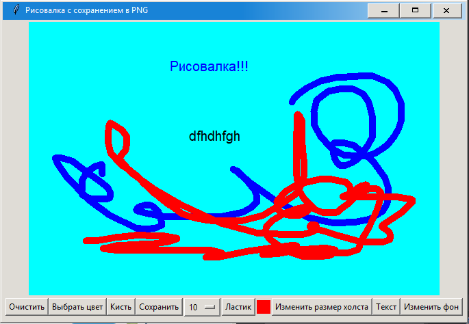

# Рисовалка с сохранением изображений в PNG

### Требования

Перед запуском убедитесь, что у вас установлены следующие пакеты:

- Python 3.7 или выше
- Библиотека Pillow для работы с изображениями

### Возможности

### Основной функционал:

- Рисование линий: Вы можете рисовать на холсте простые линии, двигая мышь с зажатой левой кнопкой.
- Очистка холста: Кнопка "Очистить" полностью очищает холст, чтобы начать работу заново.
- Выбор кисти: В выпадающем меню вы можете выбрать размер кисти — от тонких линий (1 пиксель) до широкой кисти (20 пикселей).
- Изменение цвета кисти: Кнопка "Выбрать цвет" открывает палитру, где можно выбрать любой цвет для вашего инструмента.
- Сохранение изображения: После завершения работы вы можете сохранить ваш рисунок в формате PNG, нажав кнопку "Сохранить".

### Интерфейс приложения

Интерфейс приложения состоит из двух основных частей:
1. Холст для рисования (основная часть окна приложения).
2. Панель инструментов управления, которая включает:
  - Кнопку "Очистить" для очистки холста.
  - Кнопку "Выбрать цвет" для изменения цвета кисти.
  - Выпадающий список "Размер кисти" для выбора толщины линии.
  - Кнопку "Сохранить" для сохранения изображения.

### Структура кода

Код приложения полностью реализован в одном файле drawing_app.py. Вот основные компоненты приложения:

1. Класс DrawingApp:
  - Отвечает за весь функционал рисовалки.
  - Создаёт элементы пользовательского интерфейса и обрабатывает события, такие как рисование, выбор цвета и сохранение файлов.
  
2. Основной функционал (main):
  - Запускает главный цикл приложения.

Код реализован с использованием библиотек:
- tkinter для пользовательского интерфейса;
- Pillow для работы с изображениями, которые сохраняются на диск.
